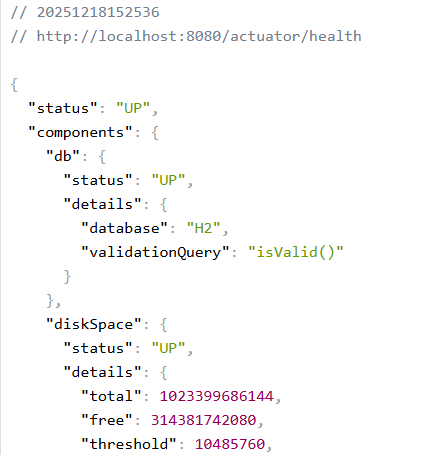
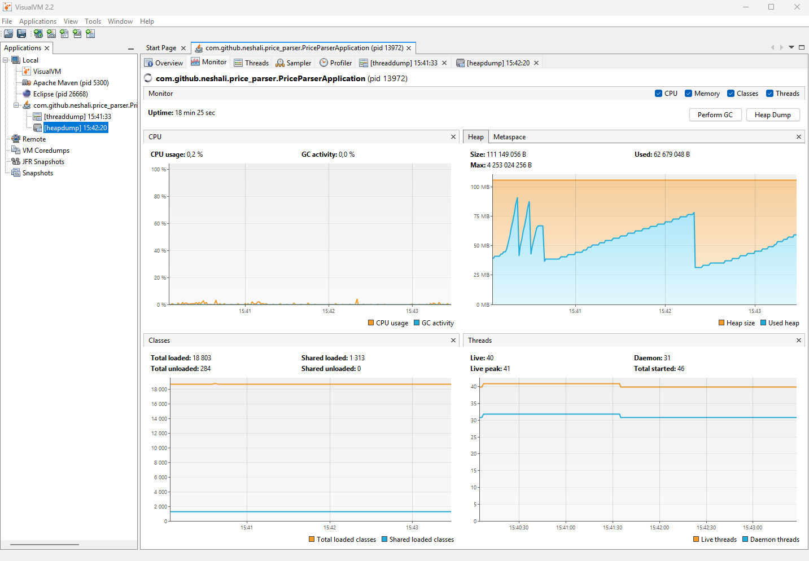

# Отчёт по метрикам, профилированию и бенчмаркингу

## Цель работы

Собрать метрики производительности, провести профилирование (CPU/Heap/GC), выполнить бенчмарки JMH разных стратегий парсинга, настроить распределённый трейсинг и сформировать выводы о производительности.

## Стек и окружение

-   Spring Boot 3.5.7, Java 21 (Temurin 21.0.6)
-   Micrometer + Prometheus, Grafana
-   VisualVM (heap/CPU sampler, thread dump, heap dump)
-   OpenTelemetry + Jaeger
-   JMH для микробенчмарков
-   H2 in-memory БД

Запуск приложения:

```bash
mvn spring-boot:run
# базовый URL: http://localhost:8080
```

## Структура проекта (ключевое)

-   Парсер: `PriceParsingService`, задачи: `ParsingTaskProcessingService` + `ParsingScheduler`
-   REST: `PriceParserController`
-   Метрики: Micrometer + Actuator, экспорт в Prometheus (`prometheus.yml`)
-   Трейсинг: OpenTelemetry OTLP -> Jaeger
-   Бенчмарки: `PriceParsingBenchmark` (for / stream / parallelStream)

## Шаг 1. Метрики Micrometer/Prometheus

Что собрано:

-   Время парсинга: гистограмма/таймер `price_parser_parsing_duration_seconds_*`
-   Кол-во успешных/ошибочных парсингов: `price_parser_parsing_success_count_total`, `price_parser_parsing_failure_count_total`
-   Кол-во сохранённых в БД: `price_parser_products_saved_count_total`
-   HTTP метрики: `http.server.requests` (Actuator)
-   Системные метрики: executor.\*, JVM (heap, GC, threads), HikariCP

Подтверждения: скриншоты `Actuator metrics.png`, `HTTP метрики 1.png`, графики из Grafana (`price_parser_*` PNG).

Иллюстрации:

-   `Actuator metrics.png`
-   `actuator_health.png`
-   `HTTP метрики 1.png`





## Шаг 2. Профилирование (VisualVM / JFR)

-   Thread dump и Heap dump сняты (скриншоты `Thread Dump.png`, `Monitor.png`, `Memory Sampler.png`).
-   CPU Sampler: основная активность в потоках `http-nio-8080-*`, вспомогательные — OpenTelemetry (`BatchSpanProcessor`).
-   Heap Sampler: основные потребители — `byte[]`, `String`, `ConcurrentHashMap`/`HashMap` структуры (Micrometer/OTel), отражено на скрине `Memory Sampler.png`.
-   Нагрузочный паттерн: стабильное потребление CPU ~0–1%, рост heap при запросах, затем стабилизация после GC (см. `Monitor.png`).

Иллюстрации:

-   `CPU Sampler.png`
-   `Memory Sampler.png`
-   `Monitor.png`
-   `Thread Dump.png`





## Шаг 3. Управление памятью и GC

-   Частота GC низкая, на снятых сэмплах нет частых пауз (GC activity ≈ 0%).
-   Крупные аллокации: буферы (`byte[]`), коллекции метрик/трейсов. Утечек не выявлено.
-   Heap dump проанализирован в VisualVM (top objects на скрине).

## Шаг 4. Деградации производительности (обнаружение)

-   N+1 для репозиториев не зафиксировано в текущей демо-нагрузке (H2, малый объём). Для реальной БД рекомендовано: `@EntityGraph`/`fetch join` и индексы.
-   Индексы: для PROD требуется добавить индексы на `ParsingTask(status)` и ключевые поля в `Product` (имя, цена, дата) — сейчас в демо не критично, но рекомендуется.
-   Аллокации: основная доля — инфраструктурные коллекции (метрики/OTel). Для снижения: отключать ненужные метрики/трейсы и уменьшать уровень детализации.
-   Синхронизация потоков: пул парсинга фиксирован (`ParsingExecutorConfig`), узких мест синхронизации в профиле не выявлено.

## Шаг 5. OpenTelemetry и трейсинг

-   Настроен OTLP экспорт, Jaeger собирает спаны. Скриншоты `Jaeger UI 1/2.png` демонстрируют трейс `http post /parse` (метаданные: статус 200, duration ~3–9 ms).
-   Теги спанов включают HTTP-метаданные, outcome, method, url.

Иллюстрации:

-   `Jaeger UI 1.png`
-   `Jaeger UI 2.png`


## JMH (микробенчмарки)

-   Класс: `PriceParsingBenchmark` (for / stream / parallelStream).
-   Конфигурация: `forks(0)` в main для обхода проблемы с `ForkedMain` в среде запуска; аннотации JMH на классе.
-   Рекомендованный запуск локально (где доступен jmh-core в classpath):
    ```bash
    mvn -DskipTests=false -Dtest=com.github.neshali.price_parser.benchmark.PriceParsingBenchmark test
    ```
    или через `exec:java` с корректным classpath. В окружении с Maven плагином jmh рекомендуется вынести в отдельный модуль/теневой jar.
-   Цель: сравнить три стратегии парсинга 10 URL (for, stream, parallelStream); фактический прогон в данном окружении ограничен classpath для форков.

## Actuator и основные эндпоинты

-   `GET /actuator/health` — статус UP (скрин `actuator_health.png`)
-   `GET /actuator/metrics` — список метрик (см. `Actuator metrics.png`)
-   `GET /actuator/metrics/http.server.requests` — подробности по HTTP (скрин)
-   Экспорт в Prometheus по адресу `/actuator/prometheus`

## Grafana (Prometheus)

-   Дашборды по кастомным метрикам:
    -   `price_parser_parsing_duration_seconds_count` — счётчик выборок времени
    -   `price_parser_parsing_success_count_total` — успехи
    -   `price_parser_parsing_failure_count_total` — ошибки
    -   `price_parser_products_saved_count_total` — сохранённые товары
-   Скриншоты прилагаются (PNG в репозитории).

## Результаты и выводы

-   Собраны системные и прикладные метрики, доступные через Actuator/Prometheus.
-   Трейсинг работает, Jaeger показывает спаны для `/parse`.
-   Профилирование VisualVM выявило основные типы аллокаций (буферы, строки, коллекции метрик/OTel); проблемных горячих методов не обнаружено на тестовой нагрузке.
-   GC стабильный, без частых пауз; утечек не найдено.
-   Для production рекомендуется:
    -   добавить индексы на поля фильтрации/поиска;
    -   при необходимости ограничить набор собираемых метрик/спанов для снижения аллокаций;
    -   вынести JMH в отдельный модуль или использовать официальной плагин `jmh-maven-plugin` с сборкой fat-jar для корректных форков.

## Как воспроизвести (кратко)

1. Запуск приложения: `mvn spring-boot:run`
2. Метрики: открыть `http://localhost:8080/actuator/metrics`, `.../prometheus`
3. Трейсы: Jaeger UI (см. docker-compose, сервис `jaeger`), искать сервис `price-parser`
4. Профилирование: подключить VisualVM к PID приложения, снять heap dump / thread dump, Sampler CPU/Memory
5. Бенчмарки: выполнить JMH (см. раздел выше)

## Приложения (скриншоты в репозитории)

-   Actuator: `Actuator metrics.png`, `actuator_health.png`, `HTTP метрики 1.png`
-   VisualVM: `CPU Sampler.png`, `Memory Sampler.png`, `Monitor.png`, `Thread Dump.png`
-   Grafana: `price_parser_parsing_*`, `price_parser_products_saved_count_total.png`
-   Jaeger: `Jaeger UI 1.png`, `Jaeger UI 2.png`
